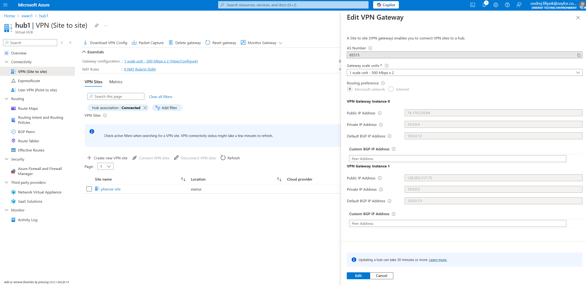

# Challenge 2: 

*   At vytvori GW
*   Az budou mít GW, tak se jich zeptat u každé instance na veřejnou IP a defaultni BGP adresu + pre-shared key



Naoplatku jim predat informace:


    * Parametry VPN site 1

        ```ip_address = "4.223.78.217"
        bgp {
        asn             = 65504
        peering_address = "10.104.0.4"
        }

    * Parametry VPN site 2

        ```ip_address = "TBD"
        bgp {
        asn             = 65505
        peering_address = "10.105.0.4"
        }


