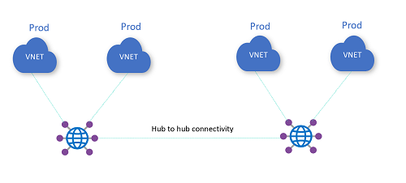

# Challenge 1: 

**[Home](../README.md)** - [Next Challenge >](../Student/02_branch_connectivity.md)

## Intro

V tého challenge vytvoříte VirtualWAN se dvěma huby a připojíte k nim spoke VNET. Vytvoříte tak full mesh connectivitu v multi-hub scénáři.

## Popis 

*   Postavte VirtualWAN, který obsahuje dva HUBy, každý v jiném regionu.
*   Do každého hubu připojte 2 spoke VNETy
*   V každé spoke VNET vytvořte minimálně jeden subnet a do něj nasaďte jeden virtuální sever
*   Vyzkoušejte komunikaci mezi všemi VM (ping, ssh/rdp)

Ukázka topologie:

## Success Criteria

- Zajistěte, aby VM z různých sítí ve stejném hubu spolu komunikovali
- Zajistěte, aby VM z různých sítí v různých hubech spolu komunikovali

## Zdroje pro studium

- [What is Virtual WAN?](https://learn.microsoft.com/en-us/azure/virtual-wan/virtual-wan-about)
- [Virtual WAN any-to-any across hubs](https://docs.microsoft.com/azure/virtual-wan/scenario-any-to-any)

