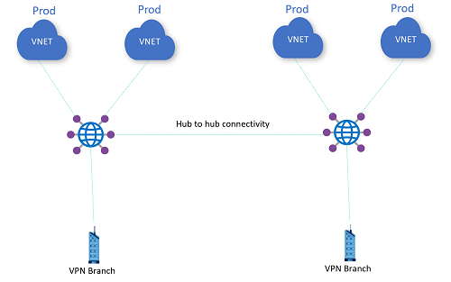

# Challenge 2: 

[< Previous Challenge](01_simple_vwan.md) - **[Home](../README.md)** - [Next Challenge >](03_isolated_vnets.md)

## Intro

V tého challenge propojíte huby s předpřipravenými VPN GW simulujícími on-premises. 

## Popis 
*   Do každého hubu nasaďte VPN GW
*   Vyžádejte si od coache parametry pro připojení k on-premises VPN GW a nasdílejte potřebné parametry pro konfiguraci on-premises strany
*   Každý hub připojte k jedné VPN GW pomocí Site2Site tunelu a pro výměnu rout použijte BGP
    * Parametry tunelu nastavte:     
   
        ```ipsec_policy {
        dh_group                 = "DHGroup14"
        ike_encryption_algorithm = "AES256"
        ike_integrity_algorithm  = "SHA256"
        encryption_algorithm     = "GCMAES128"
        integrity_algorithm      = "GCMAES128"
        pfs_group                = "None"
        sa_lifetime_sec          = "10800"
        sa_data_size_kb          = "102400000"
        }

Ukázka topologie:



## Success Criteria

- Tunely jsou sestavené, routy z on-premises se přes BGP propagují do hubů a k jednotlivým VM ve spoke sítích
- Funguje komunikace z VM z každého hubu na VM, které jsou za VPN GW na on-premises (ping, ssh)

## Zdroje pro studium

- [Virtual WAN custom routing ](https://docs.microsoft.com/azure/virtual-wan/about-virtual-hub-routing)
- [Virtual WAN isolated Vnets](https://docs.microsoft.com/azure/virtual-wan/scenario-isolate-vnets)

