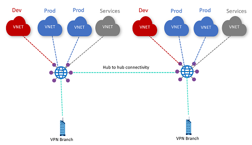

# Challenge 3: 

[< Previous Challenge](./02_branch_connectivity.md) - **[Home](../README.md)** - [Next Challenge >](./04_secured_hub.md)

## Intro

V tého challenge si vyzkoušíte pokročilý routing a izolaci VNET pomocí routingu.

## Popis 
*   Vytvořte další spoke VNETy tak, aby ke každému hubu byly připojeny přesně 4.
*   Rozdělte spoke VNETy u každého hubu dle role tak, že jedna bude sloužit pro DEV prosředí, dvě pro PROD a poslední bude obsahovat SHARED zdroje.
*   Síťově toto rozdělení znamená, že DEV může komunikovat se SHARED, ale ne s PROD. PROD může komunikovat se SHARED, ale ne s DEV. Toto platí i napříč huby, tj. PROD VNET z jednoho hubu může komunikovat s jinou PROD VNET z jiného hubu, atd.. Všechny spoke VNET nadále mohou komunikovat s on-premises.

Ukázka topologie:

## Success Criteria

- VM z DEV VNET mohou komunikovat s VM v SHARED VNETách (i napříč huby) a s VM v on-premises. VM z DEV VNET nemohou komunikovat s VM v PROD VNETách.
- VM z PROD VNET mohou komunikovat s VM v SHARED VNETách (i napříč huby) a s VM v on-premises. VM z PROD VNET nemohou komunikovat s VM v DEV VNETách.
- VM z SHARD VNET mohou komunikovat se všemi VM v obou hubech i v on-premises.

## Zdroje pro studium

- [Tutorial: Create a site-to-site connection using Azure Virtual WAN](https://learn.microsoft.com/en-us/azure/virtual-wan/virtual-wan-site-to-site-portal)
