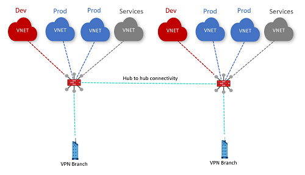

# Challenge 4: 

[< Previous Challenge](./03_isolated_vnets.md) - **[Home](../README.md)** - [Next Challenge >](./05_secured_publishing.md)

## Intro

V tého challenge si vyzkoušíte zabezpečit komunikaci ve virtualWAN / hubech pomocí Azure Firewall

## Popis 
*   Povyšte oba huby na secured huby deploymentem Azure Firewallu
*   Upravte routing tak, aby komunikace z VNET do internetu procházela firewallem
*   Na jednom z VM v PROD spoke VNET spusťte webový server a vypublikujte primitivní WEB stránku (statické „Hello World!“ stačí)
*   Zpřístupněte tuto stránku z internetu

Ukázka topologie:

## Success Criteria

- Prokažte, že nějaká komunikace z nějaké VM v nějaké SPOKE VNET odchází do internetu skrze Azure Firewall
- Prokažte, že nějaká komunikace z nějaké VM v nějaké SPOKE VNET neodchází do internetu skrze Azure Firewall, protože je na firewallu blokovaná
- Přistupte z internetu na vypublikovanou stránku

## Zdroje pro studium

- [Virtual WAN routing through NVA VNet](https://docs.microsoft.com/azure/virtual-wan/scenario-route-through-nva)
- [Virtual WAN secured virtual hub](https://docs.microsoft.com/azure/virtual-wan/scenario-route-between-vnets-firewall)
